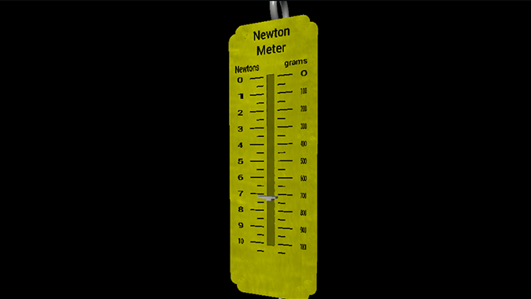
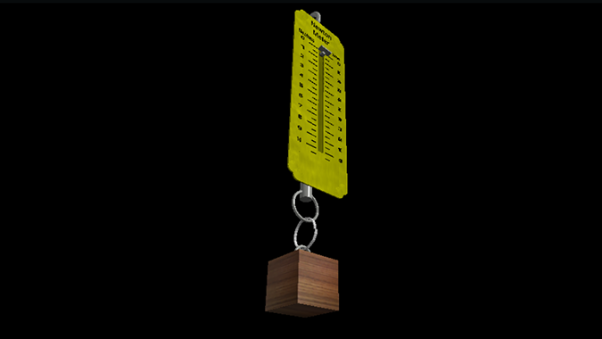
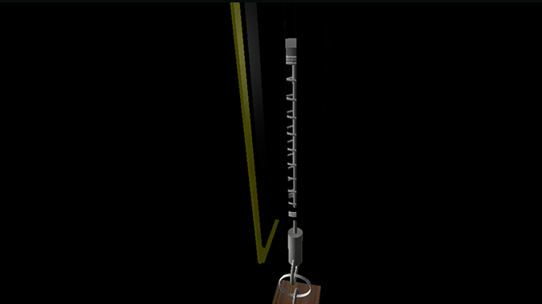

# Newton Meter

A model of a Newton Meter created using visual python. It measures the weight of the object in Newtons and grams.

## Sample Images

**Note:** The marked scales may not be perfectly accurate and are just for demonstration purposes.

## Tools used

- Visual Studio Code
- Python v3.9.7
- Visual Python v7.6.3
